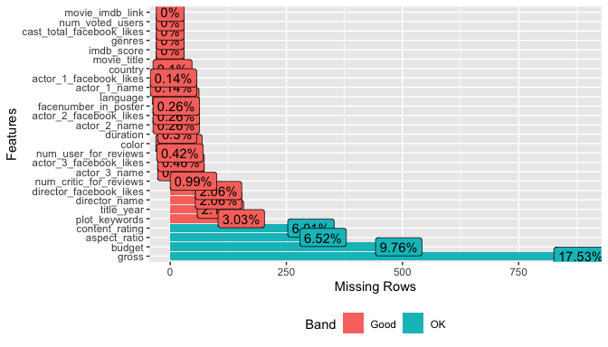
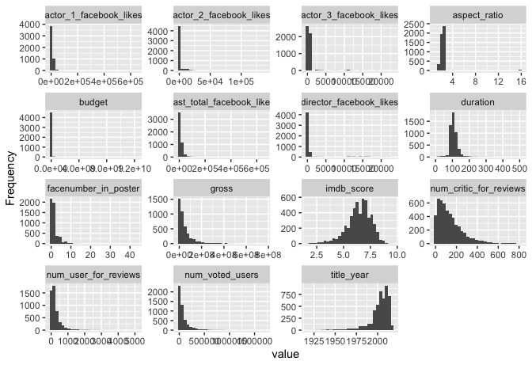

# Data


```r
df <- read_csv("movie_metadata.csv")
```

# EDA


```r
# reorder by column name
df <- df[c("movie_title", "title_year", "imdb_score",'content_rating', "genres", "color", "language", 'country', 'budget', 'gross','duration', 'aspect_ratio','plot_keywords', 'director_name', 'director_facebook_likes', 'actor_1_name', 'actor_1_facebook_likes',   'actor_2_name', 'actor_2_facebook_likes',  'actor_3_name', 'actor_3_facebook_likes', 'cast_total_facebook_likes', 'num_user_for_reviews', 'num_critic_for_reviews', 'num_voted_users', 'facenumber_in_poster', 'movie_imdb_link')]
```


```r
summary(df)
```

```
##  movie_title          title_year     imdb_score    content_rating    
##  Length:5043        Min.   :1916   Min.   :1.600   Length:5043       
##  Class :character   1st Qu.:1999   1st Qu.:5.800   Class :character  
##  Mode  :character   Median :2005   Median :6.600   Mode  :character  
##                     Mean   :2002   Mean   :6.442                     
##                     3rd Qu.:2011   3rd Qu.:7.200                     
##                     Max.   :2016   Max.   :9.500                     
##                     NA's   :108                                      
##     genres             color             language           country         
##  Length:5043        Length:5043        Length:5043        Length:5043       
##  Class :character   Class :character   Class :character   Class :character  
##  Mode  :character   Mode  :character   Mode  :character   Mode  :character  
##                                                                             
##                                                                             
##                                                                             
##                                                                             
##      budget              gross              duration      aspect_ratio  
##  Min.   :2.180e+02   Min.   :      162   Min.   :  7.0   Min.   : 1.18  
##  1st Qu.:6.000e+06   1st Qu.:  5340988   1st Qu.: 93.0   1st Qu.: 1.85  
##  Median :2.000e+07   Median : 25517500   Median :103.0   Median : 2.35  
##  Mean   :3.975e+07   Mean   : 48468408   Mean   :107.2   Mean   : 2.22  
##  3rd Qu.:4.500e+07   3rd Qu.: 62309438   3rd Qu.:118.0   3rd Qu.: 2.35  
##  Max.   :1.222e+10   Max.   :760505847   Max.   :511.0   Max.   :16.00  
##  NA's   :492         NA's   :884         NA's   :15      NA's   :329    
##  plot_keywords      director_name      director_facebook_likes
##  Length:5043        Length:5043        Min.   :    0.0        
##  Class :character   Class :character   1st Qu.:    7.0        
##  Mode  :character   Mode  :character   Median :   49.0        
##                                        Mean   :  686.5        
##                                        3rd Qu.:  194.5        
##                                        Max.   :23000.0        
##                                        NA's   :104            
##  actor_1_name       actor_1_facebook_likes actor_2_name      
##  Length:5043        Min.   :     0         Length:5043       
##  Class :character   1st Qu.:   614         Class :character  
##  Mode  :character   Median :   988         Mode  :character  
##                     Mean   :  6560                           
##                     3rd Qu.: 11000                           
##                     Max.   :640000                           
##                     NA's   :7                                
##  actor_2_facebook_likes actor_3_name       actor_3_facebook_likes
##  Min.   :     0         Length:5043        Min.   :    0.0       
##  1st Qu.:   281         Class :character   1st Qu.:  133.0       
##  Median :   595         Mode  :character   Median :  371.5       
##  Mean   :  1652                            Mean   :  645.0       
##  3rd Qu.:   918                            3rd Qu.:  636.0       
##  Max.   :137000                            Max.   :23000.0       
##  NA's   :13                                NA's   :23            
##  cast_total_facebook_likes num_user_for_reviews num_critic_for_reviews
##  Min.   :     0            Min.   :   1.0       Min.   :  1.0         
##  1st Qu.:  1411            1st Qu.:  65.0       1st Qu.: 50.0         
##  Median :  3090            Median : 156.0       Median :110.0         
##  Mean   :  9699            Mean   : 272.8       Mean   :140.2         
##  3rd Qu.: 13756            3rd Qu.: 326.0       3rd Qu.:195.0         
##  Max.   :656730            Max.   :5060.0       Max.   :813.0         
##                            NA's   :21           NA's   :50            
##  num_voted_users   facenumber_in_poster movie_imdb_link   
##  Min.   :      5   Min.   : 0.000       Length:5043       
##  1st Qu.:   8594   1st Qu.: 0.000       Class :character  
##  Median :  34359   Median : 1.000       Mode  :character  
##  Mean   :  83668   Mean   : 1.371                         
##  3rd Qu.:  96309   3rd Qu.: 2.000                         
##  Max.   :1689764   Max.   :43.000                         
##                    NA's   :13
```


```r
plot_missing(df)
```

<!-- -->


```r
plot_histogram(df)
```

<!-- -->


```r
colnames(df)
```

```
##  [1] "movie_title"               "title_year"               
##  [3] "imdb_score"                "content_rating"           
##  [5] "genres"                    "color"                    
##  [7] "language"                  "country"                  
##  [9] "budget"                    "gross"                    
## [11] "duration"                  "aspect_ratio"             
## [13] "plot_keywords"             "director_name"            
## [15] "director_facebook_likes"   "actor_1_name"             
## [17] "actor_1_facebook_likes"    "actor_2_name"             
## [19] "actor_2_facebook_likes"    "actor_3_name"             
## [21] "actor_3_facebook_likes"    "cast_total_facebook_likes"
## [23] "num_user_for_reviews"      "num_critic_for_reviews"   
## [25] "num_voted_users"           "facenumber_in_poster"     
## [27] "movie_imdb_link"
```

## Univariate 


